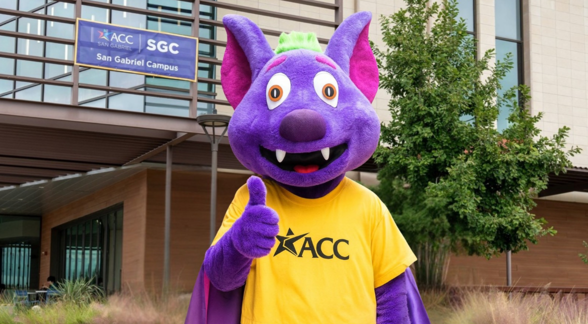
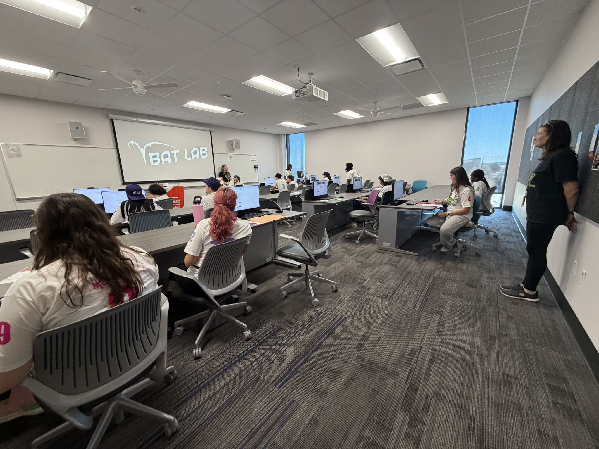

# R.B.'s Bat Lab

R.B.'s Bat Lab is an interactive digital literacy learning experience designed to introduce participants to practical computing concepts through a series of themed challenges.

The project combines coding, cybersecurity, data analysis, AI literacy, file organization, and password security in a gamified environment built with HTML, CSS, and JavaScript.

## About the Project

R.B.'s Bat Lab was created as a hands-on challenge where participants progress through different digital tasks and simulations.

Instead of only reading about digital literacy concepts, participants are asked to apply them by solving problems, analyzing information, making decisions, and completing interactive activities.

The experience includes activities related to:

- Coding and cipher decoding
- Multi-factor authentication
- Phishing awareness
- Data analysis
- AI and digital communication
- File organization
- Password security

## The Challenge in Action

The project was used as an interactive participant experience where users worked through the different activities and challenges.

## How the Experience Works

Participants begin with a simulated login and authentication process before progressing through several digital literacy activities.

Each section introduces a different skill or concept.

### Coding and Cipher Decoding

Participants work through a simulated GitHub-style coding activity and use simple Python concepts and a Caesar cipher to decode messages.

### Cybersecurity

Participants review simulated email messages and identify phishing indicators such as suspicious sender information, urgency, unusual links, and requests for personal information.

### Data Analysis

Participants use a spreadsheet to review data, identify patterns, and answer questions based on their findings.

### AI and Digital Communication

Participants interact with a simulated digital assistant and follow prompts to complete a structured problem-solving activity.

### File Organization

Participants organize different types of digital files into appropriate folders based on their contents and purpose.

### Password Security

Participants apply password security concepts as part of the final stages of the challenge.

## Technologies Used

This project uses:

- HTML
- CSS
- JavaScript
- Microsoft Excel
- Google Sites

## Project Goals

The purpose of R.B.'s Bat Lab is to explore how interactive design and gamification can be used to teach practical digital literacy and computing skills.

The project was designed to make technical concepts more approachable by placing participants inside a simulated digital environment rather than presenting the material only through traditional instructions or presentations.

## Project Links

- [Launch the Interactive Challenge](https://sites.google.com/view/csitchallenge/home)
- [View the LinkedIn Project Post](https://lnkd.in/p/gBYsuTM8)

## Repository Contents

This repository contains the source files and supporting materials used to develop the interactive portion of R.B.'s Bat Lab.

Additional documentation and project materials may be added as the project continues to develop.

## Project Status

Active project.

Future improvements may include:

- Improved accessibility
- Additional challenge modules
- Expanded facilitator documentation
- Code organization and refinement
- Additional testing
- Improved mobile responsiveness

## Facilitator Resources

For challenge solutions, facilitation notes, and troubleshooting guidance, see the [Facilitator Guide](FACILITATOR_GUIDE.md).

## Disclaimer

R.B.'s Bat Lab is an independently developed educational project and is not an official Austin Community College website or authentication system.

Any login, authentication, email, password, or security interfaces included in the project are simulations created for educational purposes.

Participants should never enter real usernames, passwords, or other personal credentials into the simulation.
